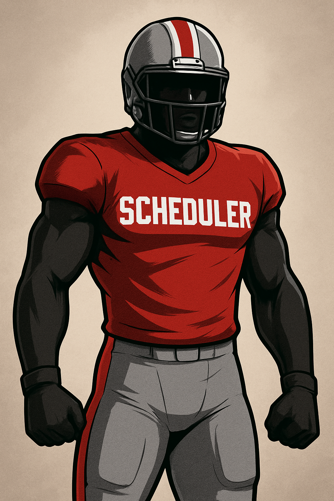

# pro-football-scheduler

How It Works

    The main script, controllingScript.py, calls two helper scripts:

        shuffle.py

        makeAWeek.py

    After the schedule is generated, run makePrintOut.py to display the schedule in a clean, human-readable format.

Setup

    Before running any scripts, you need to manually create a matchups.fil file that contains the predefined matchups for the league.

    There is also an optional byes.fil file for specifying bye weeks.

Requirements

    The scripts use the shebang line: #!/usr/bin/python3

    Make sure you have Python 3 installed on your system to run them.

